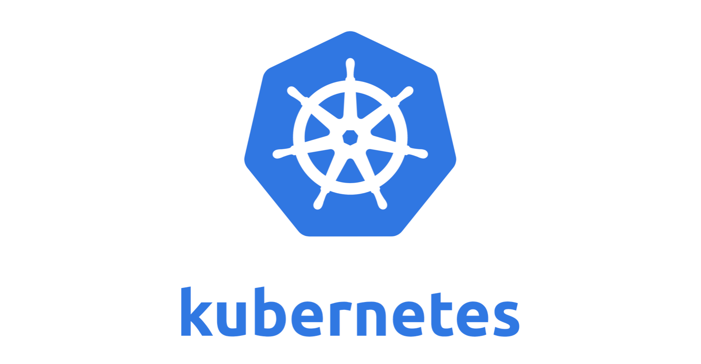
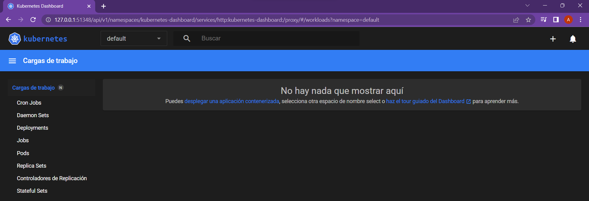
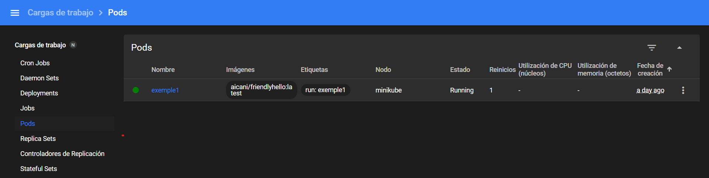
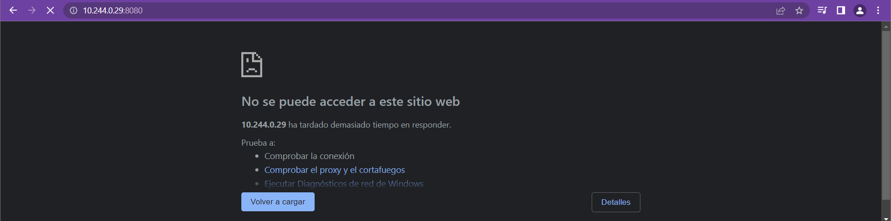
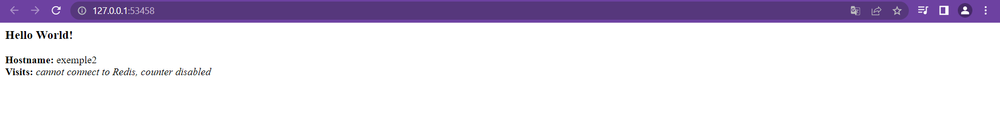

# M08 - UF03 - Kubernetes
Kubernetes (K8s) és una plataforma de codi obert per automatitzar la implementació, escalat i administració d'aplicacions web en contenidors. K8s agrupa els contenidors que conformen l'aplicació en unitats lògiques per a una fàcil administració



Com que aquest tipus d'infraesctructura s'enfoquen en entorns compartits, requereix d'entorns per al desenvolupament, preproducció i producció. Els desenvolupadors necessiten disposar d'entorns personals per a poder testejar abans de promocionar.
Per això K8s té eines com són _minikube_ i _microk8s_ que són entorns reduïts i senzills que ajuden a l'aprenentatge.
Nosaltres utilitzarem minikube.

## Intal·lació Minikube (windows):
[Enllaç Minikube](https://minikube.sigs.k8s.io/docs/start/)

1. Utilitza el PowerShell i executa:
```
New-Item -Path 'c:\' -Name 'minikube' -ItemType Directory -Force
Invoke-WebRequest -OutFile 'c:\minikube\minikube.exe' -Uri 'https://github.com/kubernetes/minikube/releases/latest/download/minikube-windows-amd64.exe' -UseBasicParsing
```
2. Afegeix el binari _minikube.exe_ al teu _PATH_
```
$oldPath = [Environment]::GetEnvironmentVariable('Path', [EnvironmentVariableTarget]::Machine)
if ($oldPath.Split(';') -inotcontains 'C:\minikube'){ `
  [Environment]::SetEnvironmentVariable('Path', $('{0};C:\minikube' -f $oldPath), [EnvironmentVariableTarget]::Machine) `
}
```
Per poder continuar has de tancar la terminal amb la qual has fet la instal·lació i obrir-ne un altre

---
## Intal·lació Kubectl (windows):
[Enllaç Kubectl](https://kubernetes.io/docs/tasks/tools/install-kubectl-windows/#install-kubectl-binary-with-curl-on-windows)

És una interfície de línia d'ordres per a executar comandes sobre desplegaments clusteritzats de Kubernetes
Executa a la terminal:
```
curl.exe -LO "https://dl.k8s.io/v1.26.0/bin/windows/amd64/kubectl.exe.sha256"
```
---
## Comencem:
Utilitza una terminal i iniciem minikube (tarda bastant a iniciar):
```
$ minikube start
😄  minikube v1.29.0 en Microsoft Windows 11 Home 10.0.22621.1265 Build 22621.1265
✨  Using the docker driver based on existing profile
👍  Starting control plane node minikube in cluster minikube
🚜  Pulling base image ...
🤷  docker "minikube" container is missing, will recreate.
🔥  Creando docker container (CPUs=2, Memory=2200MB) ...
🐳  Preparando Kubernetes v1.26.1 en Docker 20.10.23...
🔗  Configurando CNI bridge CNI ...
🔎  Verifying Kubernetes components...
    ▪ Using image docker.io/kubernetesui/metrics-scraper:v1.0.8
    ▪ Using image docker.io/kubernetesui/dashboard:v2.7.0
    ▪ Using image gcr.io/k8s-minikube/storage-provisioner:v5
💡  Some dashboard features require the metrics-server addon. To enable all features please run:

        minikube addons enable metrics-server


🌟  Complementos habilitados: storage-provisioner, default-storageclass, dashboard
🏄  Done! kubectl is now configured to use "minikube" cluster and "default" namespace by default
```
Comprovem l'estat:
```
$ minikube status
minikube
type: Control Plane
host: Running
kubelet: Running
apiserver: Running
kubeconfig: Configured
```
El Dashboard és la interfície gràfica per poder controlar els serveis i pods
Executem el dashboard:
```
minikube dashboard --url
🤔  Verifying dashboard health ...
🚀  Launching proxy ...
🤔  Verifying proxy health ...
http://127.0.0.1:51348/api/v1/namespaces/kubernetes-dashboard/services/http:kubernetes-dashboard:/proxy/
```
S'obre al navegador el següent:

Per tancar dashboard hem d'executar ````^C````

Comprovem a docekr si s'ha ccreat la imatge:
```
$ docker ps -a
CONTAINER ID   IMAGE                                 COMMAND                  CREATED         STATUS         PORTS                                                                                                                                  NAMES
b5d860eee314   gcr.io/k8s-minikube/kicbase:v0.0.37   "/usr/local/bin/entr…"   6 minutes ago   Up 6 minutes   127.0.0.1:51275->22/tcp, 127.0.0.1:51271->2376/tcp, 127.0.0.1:51273->5000/tcp, 127.0.0.1:51274->8443/tcp, 127.0.0.1:51272->32443/tcp   minikube
```
Aquí comprovem que ja s'ha creat i podem continuar


Creem el primer POD:
Un **pod** és un objecte més petit i bàsic que s'implementa a K8s. Representa una instància única d'un procés d'execució en el cluster. Els pods poden contenir un o diversos contenidors com els de docker
Les imatges dels contenidors representen les dades binàries que encapsulen una aplicació i totes les seves dependències
```
$ kubectl run exemple1 --image=aicani/friendlyhello:latest --port=8080
pod/exemple1 created
```
En el codi anterior estem utilitzant _kubectl run_ per indicar que estem creant un pod, _exemple1_ és el nom que tindrà el pod, _--image=aicani/friendlyhello:latest_ és la imatge en si que utilitzem, i _--port=8080_ és a quin port ho cridarem.
La imatge la cridem així perquè està a _"https://hub.docker.com/"_ i és on busquen per defectes les imatges. En cas que tinguéssim la imatge allotjada a un altre servidor hem d'utilitzar la següent ruta: _--image=docker pull aicani/friendlyhello:latest_ canviant "docker" pel que sigui.

Des del dashboard anem a Workloads > Pods i podem veure que s'ha creat el pod _"exemple1"_

A vegades és possible que no puguem accedir al dashboard, així que també podem veure els pods que tenim creats des de la terminal:
```
$ kubectl get pods
NAME       READY   STATUS    RESTARTS      AGE
exemple1   1/1     Running   1 (43h ago)   44h
```

```
kubectl describe pod exemple1
Name:             exemple1
Namespace:        default
Priority:         0
Service Account:  default
Node:             minikube/192.168.49.2
Start Time:       Mon, 06 Mar 2023 20:28:03 +0100
Labels:           run=exemple1
Annotations:      <none>
Status:           Running
IP:               10.244.0.29
IPs:
  IP:  10.244.0.29
Containers:
  exemple1:
    Container ID:   docker://30942881509f67addee4e1c56b3cae24084f5b2f0033e98fbc8c6099dc37f942
    Image:          aicani/friendlyhello:latest
    Image ID:       docker-pullable://aicani/friendlyhello@sha256:587ee4012b0b20a15f2bec031fbd808dcb792f8b031d2451470d8b6e54203713
    Port:           8080/TCP
    Host Port:      0/TCP
    State:          Running
      Started:      Tue, 07 Mar 2023 16:45:05 +0100
    Last State:     Terminated
      Reason:       Error
      Exit Code:    137
      Started:      Mon, 06 Mar 2023 20:28:17 +0100
      Finished:     Mon, 06 Mar 2023 20:49:39 +0100
    Ready:          True
    Restart Count:  1
    Environment:    <none>
    Mounts:
      /var/run/secrets/kubernetes.io/serviceaccount from kube-api-access-tc9zm (ro)
Conditions:
  Type              Status
  Initialized       True
  Ready             True
  ContainersReady   True
  PodScheduled      True
Volumes:
  kube-api-access-tc9zm:
    Type:                    Projected (a volume that contains injected data from multiple sources)
    TokenExpirationSeconds:  3607
    ConfigMapName:           kube-root-ca.crt
    ConfigMapOptional:       <nil>
    DownwardAPI:             true
QoS Class:                   BestEffort
Node-Selectors:              <none>
Tolerations:                 node.kubernetes.io/not-ready:NoExecute op=Exists for 300s
                             node.kubernetes.io/unreachable:NoExecute op=Exists for 300s
Events:
  Type    Reason          Age   From               Message
  ----    ------          ----  ----               -------
  Normal  Scheduled       44h   default-scheduler  Successfully assigned default/exemple1 to minikube
  Normal  Pulling         44h   kubelet            Pulling image "aicani/friendlyhello:latest"
  Normal  Pulled          44h   kubelet            Successfully pulled image "aicani/friendlyhello:latest" in 12.644498377s (12.644533742s including waiting)
  Normal  Created         44h   kubelet            Created container exemple1
  Normal  Started         44h   kubelet            Started container exemple1
  Normal  SandboxChanged  24h   kubelet            Pod sandbox changed, it will be killed and re-created.
  Normal  Pulling         24h   kubelet            Pulling image "aicani/friendlyhello:latest"
  Normal  Pulled          24h   kubelet            Successfully pulled image "aicani/friendlyhello:latest" in 4.194127303s (4.194137632s including waiting)
  Normal  Created         24h   kubelet            Created container exemple1
  Normal  Started         24h   kubelet            Started container exemple1
```
Amb la comanda anterior podem veure tota la informació de manera detallada del pod que vulguem com: la imatge utilitzada, el port, la IP, l'estat, etc.

En aquest punt, l'aplicació ja està desplegada, però no s'hi pot accedir des del navegador, si provem d'accedir amb la IP que ens mostra la descripció del pod "10.244.0.29" i el port que li hem dit abans "8080" la pàgina no carrega, ja que encara no està exposada i funciona a nivell del cluster


Per exposar el pod que vulguem necessitem la següent comanda:
```
$ kubectl expose pod exemple1 --type=LoadBalancer --port=8080 --target-port=80
service/exemple1 exposed
```
Comprovem els serveis que tenim actius, i veiem que encara no tenim una IP externa.

El ''''--type=LoadBalancer'''' indica que volem exposar el servei fora del cluster i que sigui accessible amb la comanda "''''minikube service''''"

```
$ kubectl get services
NAME                          TYPE           CLUSTER-IP       EXTERNAL-IP   PORT(S)          AGE
exemple1                      LoadBalancer   10.111.111.2     <pending>     8080:31251/TCP   3m31s
kubernetes                    ClusterIP      10.96.0.1        <none>        443/TCP          4d19h
```

Per veure més detalls del servei
```
$ kubectl describe service exemple1
Name:                     exemple1
Namespace:                default
Labels:                   run=exemple1
Annotations:              <none>
Selector:                 run=exemple1
Type:                     LoadBalancer
IP Family Policy:         SingleStack
IP Families:              IPv4
IP:                       10.111.111.2
IPs:                      10.111.111.2
Port:                     <unset>  8080/TCP
TargetPort:               80/TCP
NodePort:                 <unset>  31251/TCP
Endpoints:                10.244.0.34:80
Session Affinity:         None
External Traffic Policy:  Cluster
Events:                   <none>
```

Ara li hem de demanar a minikube que ens mostri l'URL
```
$ minikube service --url exemple2
http://127.0.0.1:53458
❗  Porque estás usando controlador Docker en windows, la terminal debe abrirse para ejecutarlo.
```

Podem entrar a "http://127.0.0.1:53458" amb el navegador web i veiem que ja funciona


## Neteja
Eliminar els recursos del cluster creats
````
kubectl delete service hello-node
kubectl delete deployment hello-node
````

Parar la màquina virtual minikube
````
minikube stop
````

Eliminar la mAquina virtual minikube
````
minikube delete
````